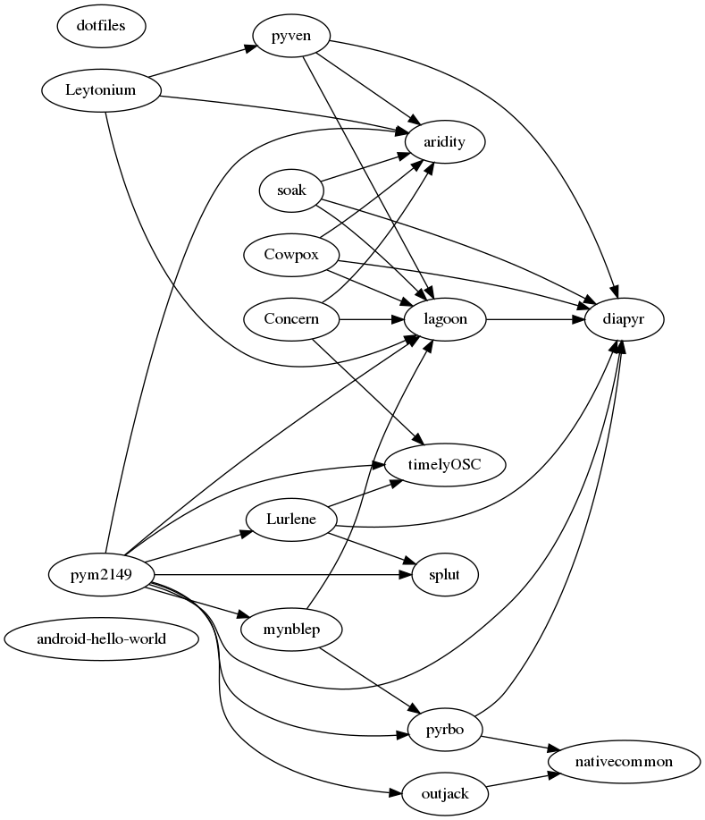

# Andrzej stack
Hi I'm Andrzej, the impresario and programmer. My background is Java/Kotlin but these days I do everything in Python, much more productive, much less hassle. I'm particularly interested in delivering focused interoperable tools to minimise rigmarole for both developers and users, and enforcement of their functionality via automated testing.

## Yes
* We deliver value at pace via [Defect Driven Design](https://web.archive.org/web/20151103111048/https://weblogs.java.net/blog/kcpeppe/archive/2011/11/29/defect-driven-design-makes-comeback)
* We stay [DRY](https://en.wikipedia.org/wiki/Don't_repeat_yourself#DRY_vs_WET_solutions) so that nobody has to jump through hoops

## No
* Unlike [opinionated frameworks](https://helm.sh/docs/chart_best_practices/) we let you choose your own workflow
* We don't waste anyone's time with cosmetic concerns such as [PEP 8](https://www.python.org/dev/peps/pep-0008/#a-foolish-consistency-is-the-hobgoblin-of-little-minds)

## Maintained projects dependency graph

